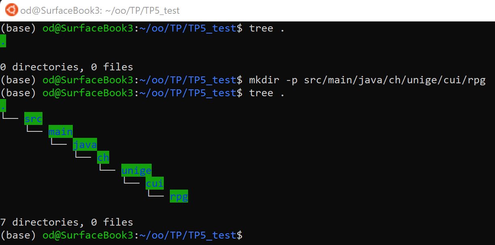

\definecolor{codegreen}{rgb}{0,0.6,0}
\definecolor{codegray}{rgb}{0.5,0.5,0.5}
\definecolor{codepurple}{rgb}{0.58,0,0.82}
\definecolor{backcolour}{rgb}{0.95,0.95,0.92}

\lstdefinestyle{mystyle}{
    backgroundcolor=\color{backcolour},   
    commentstyle=\color{codegreen},
    keywordstyle=\color{magenta},
    numberstyle=\tiny\color{codegray},
    stringstyle=\color{codepurple},
    basicstyle=\ttfamily\footnotesize,
    breakatwhitespace=false,         
    breaklines=true,                 
    captionpos=b,                    
    keepspaces=true,                 
    numbers=left,                    
    numbersep=5pt,                  
    showspaces=false,                
    showstringspaces=false,
    showtabs=false,                  
    tabsize=2
}

\lstset{style=mystyle}

\section{Introduction}
Les objectifs de ce TP sont de mettre en pratique le concept d'*héritage* en Java. Comme cela vous a été expliqué en cours, il est rarement nécessaire d'utiliser l'héritage. On peut souvent avantageusement le remplacer par l'utilisation d'interfaces pour créer des relations de sous-typage. Néanmoins, il est utile de comprendre le concept, notamment pour être en mesure de comprendre du code déjà existant qui le met en oeuvre. Continuez à utiliser gradle pour compiler et exécuter votre programme. Il faut donc respecter les conventions de gradle que nous avons apprise lors du TP précédent et créer un script build.gradle. Ce dernier sera très similaire à celui du TP précédent, vous pouvez donc le reprendre et le modifier.
Reprenez votre code (ou la solution, si vous préférez) du TP précédent, car nous allons en réutiliser une partie.

\section{Héritage et sous-classement}
\subsection{Exercice 1}

Dans cet exercice, il s'agit de créer de nouvelles classes héritant de deux super-classes Humanoïde (``Humanoid``) et mort-vivant (``Undead``) qui elle-même réalisent une interface : ``GameCharacter``. Cette interface spécifie des getters qui correspondent à des champs très ''génériques'', i.e., que tout personnage doit avoir, à savoir:

- un nom (name) qui peut servir d'identifiant unique car on ne permet pas à deux personnages d'avoir le même nom
- un niveau (level)
- un nombre de points de de vie max (max. health points)
- un nombre de points de vie courant

L'interface ``GameCharacter`` impose aussi la présence des méthodes ``public void wound(Damage dmg)`` et ``public void heal(Damage hp)``. Vous pouvez constater que contrairement au TP précédent, la méthode heal prend cette fois-ci en arguement un objet de type ``Damage``. Il vous faudra faire une légère modification pour que les soins soient calculés à partir des champs physical, magical et fire d'un objet Damage passé en paramètre (des précisions sont apportées plus loin).

Les classes Humanoid et Undead représentent les concepts de jeu suivants:

Humanoide:

- est mortel: c'est à dire que si ses points de vie arrivent à 0, le personnage est mort et ne peut plus effectuer aucune action, e.g., ne peut être attaqué ni lui-même attaquer, ne peut être soingé, ne peut démarrer de quête etc.
- est sensible à tous les types de dégats (cf. classe Damage, i.e., physical, magical, fire).
- l'implémentation des méthodes wound et heal requise par l'interface se fait ''normalement'', i.e., wound va blesser le personnage et lui enlever des points de vie exactement de la même manière que dans le TP précédent, la protectionStack étant présente comme avant. La méthode heal va soigner le joueur, comme avant mis à part que le nombre de points de vie est la somme des champs de l'objet Damage passé en paramètre.

Mort-vivant (undead):

- n'est ni vivant ni mort (undead): ne peut pas mourir (pas de champ ``isAlive``), mais ses points de vie peuvent néanmoins tomber à 0, par contre, il pourra être soigné, même en étant ''mort'' et regagner des HP.
- n'est pas sensible aux dégats physiques, mais seulement au dégats magique et feu.
- pour les morts-vivants, les méthodes wound et heal fonctionnent ''à l'envers'', i.e., si il est blessé par des dégats physiques (wound) le mort vivant est soigné du montant exact des dégats. S'il est soigné (heal) alors il pert un nombre de points de vie égal aux dégats. Attention cependant à gérer la sensibilité aux types de dégats: dans la méthode heal, seul feu et magie ont un impact et dans la méthode wound seul les dégats physique ont un impact (i.e. soigne le mort-vivant).

Finalement, implémenter des classes héritant de ces dernières, par exemple:

HumanWarrior :

- hérite de la classe humanoide (notamment les méthodes wound et heal).
- possède les champs gold et quests/questlog présents dans le TP précédent.
- possède la méthode startQuest du TP précédent (cf. solution si besoin).

GhoulMage :

- hérite de la class undead (notamment les méthodes wound et heal mais qui fontionnent à l'envers de celles d'un humanoïde).
- possède des points de mana qui diminuent lorsque'elle jette un sort.
- peut lancer des sorts (méthode ``public Damage castSpell()``) : le coût en mana du sort est déduit du champ mana et un objet Damage avec seulement des dégats magiques de la même valeur que le coût en mana est retourné. Si la mana est insuffisante, un objet avec une valeur de 0 dommages (équivalent à pas de dommages est retourné).
- son mana peut être regénéré (méthode ``public void manaRegen(int mana)``)
- n'a pas d'armure donc pas de protectionStack
- ne peut pas effectuer de quêtes

Rien ne vous empêche d'en inventer d'autres si vous voulez ...

**Remarques:**

- Pour l'affichage, il est très pratique de redéfinir (@Override) la méthode toString dans toutes les classes dont vous voulez avoir un affichage des champs rapidement et vous pouvez utiliser super.toString() pour appeler la méthode toString redéfinie dans une classe parente.
- Vous aurez besoin d'utiliser l'instruction ``super()`` pour invoquer le constructeur de d'une super-classe.
- Nous allons utiliser l'héritage ici notamment pour éviter d'écrire du code redondant: pensez au méchanisme d'héritage qui justement permet aux sous-classes "d'hériter" des champs et méthodes de la classe mère.
- il peut être judicieux de mettre l'accessibilité de certains champs ``protected`` pour éviter de creer un setter, pensez aux champs maxHP, currentHP ou isAlive de la classe Humanoid par exemple, en effet il sera par exemple utile de tester si un joueur humanoide est vivant pour savoir s'il peut démarrer une quête.
- On n'a pas d'héritage multiple en Java, mais il y a la transitivité, i.e., une classe C qui hérite d'une classe B qui elle-même hérite d'une classe A, hérite aussi de la classe A par transitivité. (Héritage "simple" à travers une "branche" dont la racine est la classe mère ``Object``).
- Pour vous aider, la classe contenant la méthode main() avec le script de démo présenté durant la session de TP vous est fourni ainsi que l'output désiré dans un fichier texte, libre à vous de l'améliorer.
- Pour créer une arborescence de répertoires directement de manière très pratique en ligne de commande vous pouvez taper ``mkdir -p src/main/java/ch/unige/cui/rpg`` depuis le dossier courant (.) par exemple, et constater le résultat avec la commande ``tree``, comme illustré sur la Figure 1).

\section{Exercice 2}
Réaliser le diagramme UML de l'exercice précédent. Déposez le dans un format d'image matricielle (e.g., .png, .jpg, etc.) ou diagramme vectoriel (e.g., .svg, .pdf) mais pas un format text.

\section {Rendu}

Ce TP n'est pas noté. Néanmoins, nous vous demandons de le déposer sur Moodle via le widget prévu à cet effet. Archivez *votre projet tout entier* dans **un seul** fichier .zip avec la convention de nommage suivante: **prenomNomTP5.zip**. 

N'oubliez pas de toujours inclure votre script **build.gradle**, bien évidemment (puisque vous déposez votre projet tout entier dans une archive zip).
