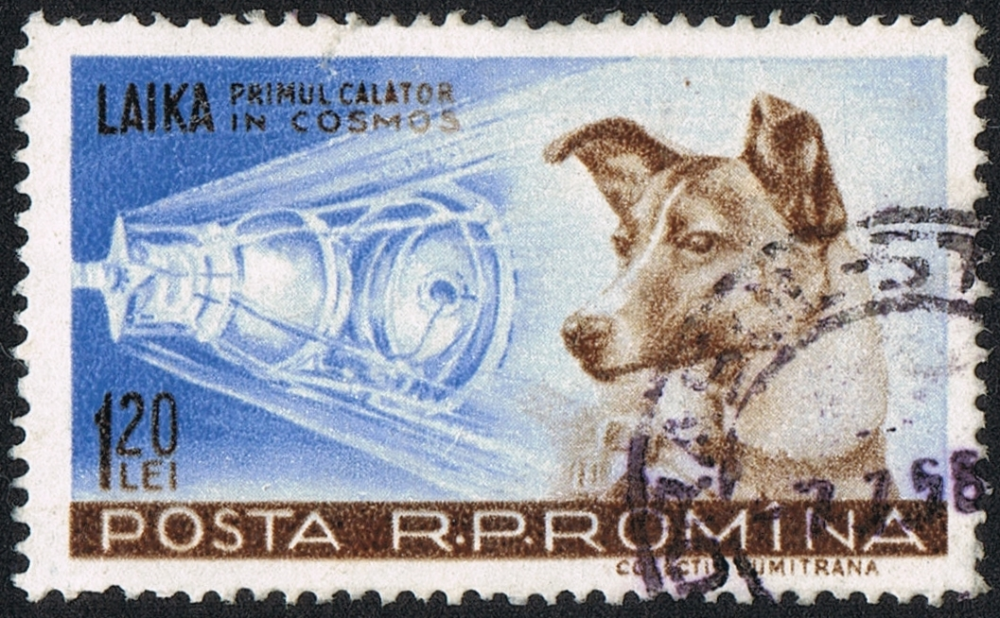

\definecolor{codegreen}{rgb}{0,0.6,0}
\definecolor{codegray}{rgb}{0.5,0.5,0.5}
\definecolor{codepurple}{rgb}{0.58,0,0.82}
\definecolor{backcolour}{rgb}{0.95,0.95,0.92}

\lstdefinestyle{mystyle}{
    backgroundcolor=\color{backcolour},   
    commentstyle=\color{codegreen},
    keywordstyle=\color{magenta},
    numberstyle=\tiny\color{codegray},
    stringstyle=\color{codepurple},
    basicstyle=\ttfamily\footnotesize,
    breakatwhitespace=false,         
    breaklines=true,                 
    captionpos=b,                    
    keepspaces=true,                 
    numbers=left,                    
    numbersep=5pt,                  
    showspaces=false,                
    showstringspaces=false,
    showtabs=false,                  
    tabsize=2
}

\lstset{style=mystyle}

\section{Introduction}
L'objectif de ce TP est de réviser les notions de classes anonymes, expressions lambda et streams avec des exemples simples. Nous allons lire un fichier text contenant des noms d'animaux de compagnie - dont la célèbre chienne Laika, le premier animal envoyé dans l'espace, à bord du Sputnik 2 - qui vous est fourni sur Moodle et utiliser les streams pour réaliser différentes opérations de filtrage. 

{ width=45% }

 
\section{Exercice 1}
Creer un fichier Main.java et déclarer les interfaces suivantes.

\begin{lstlisting}[language=Java]
interface Animal{}
interface Cat extends Animal{}
interface ReadFileInterf<T>{
    public void readFile(String fileName);
    public ArrayList<T> getFileContents();
}
\end{lstlisting}

Durant ce TP de révision, tout le code source sera écrit dans Main.java. Comme toujours, il vous faut la méthode ``public static void main(String[] args)`` qui est le point d'entrée d'un programme Java.

\section{Exercice 2}
Instancier un Animal et un Cat ainsi qu'une arrayList d'animaux et de chats (les deux vides). Ajouter l'instance d'animal dans l'arrayList d'animaux (``animalList``) et l'instance de chat dans celle de chats (``catList``).

Constater ce qu'il se passe si vous essayez de compiler ceci:

\begin{lstlisting}[language=Java]
animalList = catList;
\end{lstlisting}

Pour résoudre le problème, créer une nouvelle liste d'animaux et la rendre *co-variante* et réessayer l'assignation (e.g., ``animalList2 = catList;``).

Essayer de faire: 
``catList = animalList;``

pour résoudre le problème, rendez la list de chats *contra-variante*.

Pourquoi a-ton besoin de faire cela? 
Car les collections sont ... en Java par opposition aux ... qui sont ...

\section{Exercice 3}
Créer un fileReader anonyme grâce à l'interface ``ReadFileInterf``. Il s'agit d'une classe anonyme qui possède une variable d'instance ``ArrayList<String> fileContents``. On garde toujours l'habitude d'avoir des champs privés. Il faut donc le getteur (spécifié dans l'interface). Finalement, implémenter la méthode ``readFile`` aussi requise par l'interface. Notez, qu'ici on veut que cette dernière ajoute chaque ligne lue depuis le fichier dans l'arrayList fileContents.

Verifiez que vous pouvez lire le fichier, e.g., afficher le contenu de la variable ``fileContents``.

\section{Exercice 4}
Ayant lu le fichier nous allons maintenant utiliser les streams pour réaliser les opérations suivantes:

- trouver les noms des animaux de compagnie qui contiennent la letter ''l'' (majuscule ou minuscule)
- trouver les noms d'animaux comportant 5 caractères.
- filtrer les doublons (i.e., collecter dans une liste les noms distincts)
- trouver les noms d'amimaux comportant 5 caractères mais cette fois sans les doublons (le faire en une ligne)

\section{Output attendu}

\begin{lstlisting}
> Task :run
1: Nala
2: Simba
3: Pumba
4: Nala
5: Nala
6: Laika
7: Laika
8: Tupaq
9: Machupicchu
10: Rex
11: Rocky
12: Loki
13: Skippy
file contents:[Nala, Simba, Pumba, Nala, Nala, Laika, Laika, Tupaq, Machupicchu, Rex, Rocky, Loki, Skippy]
petNamesWithL : [nala, nala, nala, laika, laika, loki]
petNamesWith5ch : [Simba, Pumba, Laika, Laika, Tupaq, Rocky]
uniquePetNames : [Rocky, Simba, Rex, Loki, Laika, Pumba, Tupaq, Nala, Machupicchu, Skippy]
uniquePetNamesWith5ch : [Rocky, Simba, Laika, Pumba, Tupaq]

BUILD SUCCESSFUL in 3s
7 actionable tasks: 1 executed, 6 up-to-date
\end{lstlisting}
